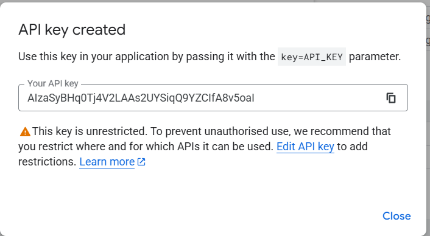

## Prerequisites: Create a Project in Google Cloud Console & setup OAuth consent screen

- **Project and API Configuration:**  
  - Go to the [Google Cloud Console](https://console.cloud.google.com/) and create a project.  
  - Then search for **project** in the top search bar.  
  - Select **Create Project**.  
    
      

  - Enter the project name (e.g., _Gemini‑Clone_) and click **Create**.  
    
      


- **Setup OAuth Consent Screen:**  
  - In the Cloud Console, select your project and navigate to **APIs & Services → OAuth consent screen**.  
  - Click **Get started**.  
    
      

  - Fill in all details:  
    - **App info:** enter app name, support email, etc., then click **Next**.  
      
        

    - **User type:** select **External**, then click **Next**.  
      
        

    - **Contact info:** enter your email, then click **Next**.  
      
        

    - Check **I agree** and click **Continue**.  
      
        

    - Finally, click **Create**.  
  - Make sure to select your newly created project whenever you use the Cloud Console (use the project selector at top right).  
    
      


---

## 1. Google OAuth Credentials (GOOGLE_ID & GOOGLE_SECRET)

**Purpose:**  
These credentials authenticate your users via Google’s OAuth 2.0 service.

**Production Setup Steps:**

- Select your project and go to **APIs & Services → Credentials**.  
- Click **Create Credentials → OAuth client ID**.  
- Choose **Web application**, enter a name, and under:  
  - **Authorized JavaScript origins**, add:  

    ```
    http://your-production-domain.com
    https://your-production-domain.com
    ```  

  - **Authorized redirect URIs**, add:  

    ```
    http://your-production-domain.com/api/auth/callback/google
    https://your-production-domain.com/api/auth/callback/google
    ```  
  

    

- Click **Create**.  
  
    

- Copy the **Client ID** and **Client Secret**, then in your `.env.local` (created from `.env.sample`) add:  

  ```bash
  GOOGLE_ID=<your-client-id>
  GOOGLE_SECRET=<your-client-secret>
  ```  

- Click **OK**.

---

## 2. Google API Key (NEXT_PUBLIC_API_KEY)

**Purpose:**  
This key authenticates client‑side requests to various Google APIs (Maps, Places, and the Generative Language API).

**Production Setup:**

- Select your project and go to **APIs & Services → Credentials**.  
- Click **Create Credentials → API key**.  
  
    

  
    

- **Restrict the API Key:**  
  1. Click on your new key.  
  2. Under **API restrictions**, select **Restrict key**.  
  3. Choose **Generative Language API** and click **Save**.  
     
       

  4. Copy the key and paste it into `NEXT_PUBLIC_API_KEY` in your `.env.local`.  

> **Alternative Way for API Key Generation:**  
>
> Visit [https://aistudio.google.com/u/0/apikey](https://aistudio.google.com/u/0/apikey), log in with the same Google account, click **Create API key**, select your project—it will auto‑restrict to the Generative Language API.  

>   


>   

> Copy that key into `NEXT_PUBLIC_API_KEY` in your `.env.local`.

---

## 3. NextAuth Secret (NEXTAUTH_SECRET)

**Purpose:**  
This secret secures sessions and token encryption for NextAuth.

**Production Setup:**

> **Note:** Node.js must be installed on your system (download from [nodejs.org](https://nodejs.org/en/download)).

- In your project root (`dev-gemini-clone`), run:  

  ```bash
  npx auth secret
  ```  

  This generates a secure random string and creates `.env.local` if it doesn’t exist.
- Copy the generated value and set in your `.env.local`:  

  ```bash
  NEXTAUTH_SECRET=<generated-secret>
  ```  

- Ensure the key name is exactly **NEXTAUTH_SECRET**.

---

## 4. Base URL for the Application (NEXTAUTH_URL)

**Purpose:**  
This URL specifies your application’s canonical domain for constructing callback URLs and other NextAuth endpoints.

**Production Setup:**

- Replace your development URL with your production domain in `.env.local`. For example:  

  ```bash
  NEXTAUTH_URL=https://your-production-domain.com
  ```  
  
- Ensure this matches exactly the authorized domains in your OAuth credentials.

---

## 5. MongoDB Connection String (MONGODB_URI)

**Purpose:**  
The connection string directs your application to your MongoDB database hosted on Atlas.

**Production Setup Using MongoDB Atlas:**

- Sign in to [MongoDB Atlas](https://www.mongodb.com/cloud/atlas) and create a cluster.  
  
    

- Click **Create → Copy Your database user creds**, then **Create database user**.  
  
    


- Choose **Choose Connection Method**
  
    


- **Select Compass installed or not**, if not: select your OS, download/launch Compass, then click **Show password** to copy the string:  
  
    


- Paste into `MONGODB_URI` in your `.env.local`.

- After that Update Network accesss to your Atlas for access the Cluster from anywhere or from your IP.

- Go to `Network Access`

- Click on `ADD IP ADDRESS`

  

- Click on `Allow Access from Anywhere` and click on `confirm`

- Now, You can see you allowed your Atlas to access your cluster from anywhere  

  

> **Note:** Store your Atlas credentials securely for future use.

---

## General Best Practices for Production Environments

- **Environment Variable Management:**  
  Use environment‑specific files (e.g., `.env.production`) excluded from version control, or leverage a secrets manager (Google Secret Manager, AWS Secrets Manager, HashiCorp Vault).

- **Secure Network and Access:**  
  Restrict access via IP whitelisting, VPNs, or VPCs; enforce HTTPS.

- **Regular Auditing and Rotation:**  
  Monitor, audit, and rotate credentials regularly; set up alerts for unusual activity.

- **Logging and Monitoring:**  
  Implement comprehensive logging/monitoring with cloud or third‑party tools to detect and respond to incidents.

