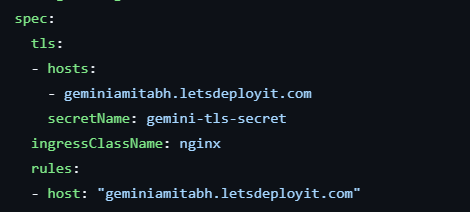
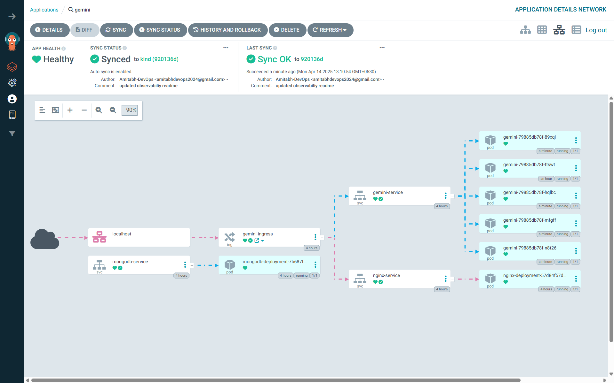
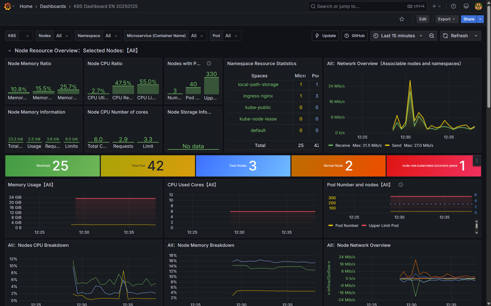
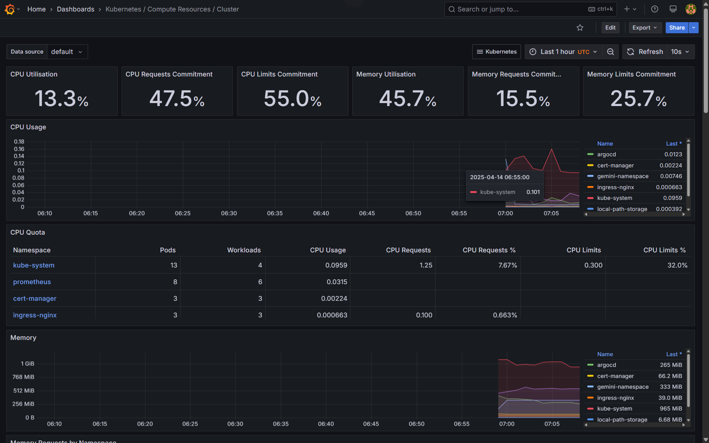

# Advanced Gemini Clone with DevSecOps Implementation


An advanced Gemini Clone built with Next.js, featuring enhanced functionality and faster response times.

> [!NOTE]
>
>  To read more about this Google Gemini Clone like it's Chat Functionality, Advanced Features and Technology Stack, for that Read this [ABOUT_APP.md](ABOUT_APP.md) file.

---

## Purpose

Follow this guide to set up a DevSecOps-ready Google Gemini Clone if you can afford the AWS EKS bill and associated costs.

---


## Setting up the Repo and Workspace

- Fork this repo on GitHub: [https://github.com/Amitabh-DevOps/dev-gemini-clone.git](https://github.com/Amitabh-DevOps/dev-gemini-clone.git)
- Clone the forked repo to your system.
- Open the project in VSCode or your preferred code editor.
- Open the integrated terminal in VSCode.
- Login to your VPS or EC2 Instance via SSH
- Now again Clone that repo into that VPS or EC2 Instance.
- Then switch to the `DevOps` branch, and go to root dir `dev-gemini-clone` using the command:

  ```bash
  git checkout DevOps

  cd dev-gemini-clone
  ```

- You're all set! Go ahead with this guide — best of luck!


>  [!TIP]
>  If you are Windows user and don't know how to get Linux/Ubuntu in your VSCode, then don't worry follow this guide : [Setting up Linux/Ubuntu in Windows VSCode](https://amitabhdevops.hashnode.dev/a-step-by-step-guide-to-adding-ubuntu-wsl-in-vs-code-terminal)

---

## To set up the environment variables for the application, follow these steps:

- Refer to the [ENV_SETUP.md](ENV_SETUP.md) file for detailed instructions on configuring the environment variables as specified in the `.env.sample`.
- Once you have collected all the required environment variables, create a `.env.local` file in the root directory of the project.
- Enter all the correct environment variable values in the `.env.local` file.  

>  **Note:** This file will need to be uploaded to Jenkins during your CI/CD pipeline process, so please ensure that all values are accurate. Additionally, these environment variables are required at the time of the Docker build.


---

## Build → Tag → Push Docker Image → Update Kubernetes Deployment

Follow this [DOCKER_BUILD.md](DOCKER_BUILD.md) to `Build → Tag → Push Docker Image → Update Kubernetes Deployment` and then follow next steps.

>  [!CAUTION]
>  
>  -  Ensure your `.env.local` file is present in the project root when running the `docker build` command, as `Next.js` apps require build‑time environment variables prefixed with `NEXT_`.
>
>  -  In other words, your `.env.local` must exist before you run `docker build` with the appropriate environment variables.
>
>  -  You do not need to specify `--env-file .env.local` in the `docker build` command; Docker will automatically load `.env.local` if it’s present in the build context.

---

## Adding Secrets & Data in `configmap.yml` and `secrets.yml`

- Keep your `.env.local` file with you.

- Provide your **NEXTAUTH_URL** in your `kubernetes/configmap.yml` from the `.env.local` file.

- After that, you have to put base64‑encoded values in `kubernetes/secrets.yml` for the following keys:  
  **GOOGLE_ID**, **GOOGLE_SECRET**, **NEXTAUTH_SECRET**, **NEXT_PUBLIC_API_KEY**, **MONGODB_URI**

- For encoding, you can use the command:  

  ```bash
  echo -n "<STRING_TO_ENCODE>" | base64
  ```

- For decoding, you can use the command:  

  ```bash
  echo -n "<STRING_TO_DECODE>" | base64 --decode
  ```

--- 


## Prerequisites for Kubernetes & ArgoCD

- **Docker** installed and configured  
- **EKSCTL** (Amazon Elastic Kubernetes Service)  
- **kubectl**  
- **aws-cli** (with `aws configure` completed)

>  [!TIP]
>
>  If you want a one stop solution to Install above Prerequisites tools, then follow this guide : 👇
>
>  Use only for above tools, do not use other installation form this guide.
>
>    [how-to-install-essential-devops-tools-on-ubuntulinux](https://amitabhdevops.hashnode.dev/how-to-install-essential-devops-tools-on-ubuntulinux)

---

# End-to-End Setup for Deploying Applications with ArgoCD and EKS

This README provides a complete step-by-step guide with all the commands required to set up ArgoCD on an AWS EKS cluster, deploy your applications, and configure GitOps.

---

# To create EKS Cluster using Terraform:

- Go to [Terraform-EKS-Deployment](Terraform-EKS-Deployment) dir and comeback after EKS Cluster creation and follow next steps

---

## **2. Deploy ArgoCD**

### **Create the ArgoCD Namespace**
```bash
kubectl create namespace argocd
```

### **Install ArgoCD Using Official Manifests**
```bash
kubectl apply -n argocd -f https://raw.githubusercontent.com/argoproj/argo-cd/stable/manifests/install.yaml
```

### **Verify ArgoCD Pods**
```bash
watch kubectl get pods -n argocd
```

### **Install ArgoCD CLI**

```bash
curl --silent --location -o /usr/local/bin/argocd \
  https://github.com/argoproj/argo-cd/releases/download/v2.4.7/argocd-linux-amd64
chmod +x /usr/local/bin/argocd
argocd version
```

### **Change ArgoCD Server Service Type to NodePort**

```bash
kubectl patch svc argocd-server -n argocd -p '{"spec": {"type": "NodePort"}}'
```

### **Verify the NodePort Service**

```bash
kubectl get svc -n argocd
```

### **Expose the Port on Security Groups**
- In the AWS Console, update the security group for your EKS worker nodes to allow inbound traffic on the NodePort assigned to the `argocd-server` service.

### **Access the ArgoCD Web UI**
- Open your browser and navigate to:

  ```
  http://<public-ip-of-worker-node>:<NodePort>
  ```

---

## **3. Configure ArgoCD for EKS**

### **Login to ArgoCD Using CLI**
```bash
argocd login <public-ip-of-worker-node>:<NodePort> --username admin
```

### **Retrieve the Default Admin Password**
```bash
kubectl get secret argocd-initial-admin-secret -n argocd \
  -o jsonpath="{.data.password}" | base64 -d
```

### **Check Available Clusters in ArgoCD**
```bash
argocd cluster list
```

### **Get the EKS Cluster Context**
```bash
kubectl config get-contexts
```

### **Add EKS Cluster to ArgoCD**
```bash
argocd cluster add <cluster-context-name> --name gemini-eks-cluster
```
- Replace `<cluster-context-name>` with your EKS cluster context name (e.g., `Amitabh@Gemini.us-west-1.eksctl.io`).

---

## 6. Additional Setup

### **6.1 Add a Repository in ArgoCD**
- Go to the ArgoCD UI.  
- Add your repository in the settings.

### **6.2 Install Helm**
```bash
# Download the Helm installation script
curl -fsSL -o get_helm.sh https://raw.githubusercontent.com/helm/helm/main/scripts/get-helm-3

# Make the script executable
chmod 700 get_helm.sh

# Run the installation script
./get_helm.sh
```

### **6.3 Install Ingress-NGINX**
```bash
# Add the NGINX Ingress controller Helm repository
helm repo add ingress-nginx https://kubernetes.github.io/ingress-nginx

# Update the Helm repository to ensure you have the latest charts
helm repo update

# Install the ingress-nginx controller in the ingress-nginx namespace
helm install ingress-nginx ingress-nginx/ingress-nginx \
  --namespace ingress-nginx --create-namespace
```

### **6.4 Install Metrics Server**

-  Apply the components for the metrics server: 

   ```bash
      kubectl apply -f https://github.com/kubernetes-sigs/metrics-server/releases/latest/download/components.yaml
   ```

-  Then edit the metrics server deployment to add necessary arguments:

   ```bash
      kubectl -n kube-system edit deployment metrics-server
   ```

-  Add these arguments under `spec.containers.args`:
   - `--kubelet-insecure-tls`
   - `--kubelet-preferred-address-types=InternalIP,ExternalIP,Hostname`

-  Save the changes, then restart and verify the deployment:

   ```bash
   kubectl -n kube-system rollout restart deployment metrics-server
   kubectl get pods -n kube-system
   kubectl top nodes
   ```

### **6.5 Install Cert-Manager for SSL/TLS**
```bash
kubectl apply -f \
  https://github.com/cert-manager/cert-manager/releases/download/v1.16.2/cert-manager.yaml
```

---

## 7. Create an Application in ArgoCD

After completing the setup, create a new application in ArgoCD with the following details:

### **General Section**
- **Application Name:** Choose a name for your application.  
- **Project Name:** Select _default_.  
- **Sync Policy:** Set to _Automatic_.  
  - Enable **Prune Resources** and **Self-Heal**.  
  - Check **Auto Create Namespace**.

### **Source Section**
- **Repo URL:** Enter the URL of your Git repository.  
- **Revision:** Select the branch (e.g., `DevOps`).  
- **Path:** Specify the directory containing your Kubernetes manifests (e.g., `kubernetes`).

### **Destination Section**
- **Cluster:** Select your desired cluster.  
- **Namespace:** Use `gemini-namespace`.

Before clicking on **Create App**, ensure the following:

> [!CAUTION]
>
>    - Your `configmap.yml` file has `NEXTAUTH_URL` set to `<YOUR_DOMAIN_NAME>`.  
>    - The Ingress configuration specifies the host and TLS settings to use `<YOUR_DOMAIN_NAME>`.  
>    - Ensure `cert-issuer.yml` has the correct email.

---

## Exposing the Application via Ingress

In this step, Once the application is healthy, we will walk through to expose your application to the outside world, using an ALB (Application Load Balancer) with a CNAME record.

1. Expose via ALB and CNAME  
   Run the following command to get the ALB External‑IP of the ingress-nginx-controller:

   ```bash
   kubectl get svc -n ingress-nginx
   ```

2. Copy the External‑IP from the output and create a CNAME record on your domain.  
   Update `gemini-ingress.yml` with your domain.  

     

3. After updating `gemini-ingress.yml`, sync the application in ArgoCD.  
4. Once synchronized, open your browser and access the application via your domain (e.g., `amitabh.letsdeployit.com`).  


#### ArgoCD Application Dashboard


---


# Jenkins Master & Agent Setup with Terraform for Advanced Gemini CI/CD Pipeline


## 1. Provisioning EC2 Instances with Terraform

1. **Navigate to your Terraform directory.**

2. **Generate an SSH key for the EC2 instances:**  
   Run the following command and specify the key name as `gemini-instance-key` (or enter your own name).  
   ```bash
   ssh-keygen
   ```  
   Once generated, update the key name in `/terraform/variable.tf` accordingly.

3. **Initialize Terraform:**
   ```bash
   terraform init
   ```

4. **Preview the Terraform execution plan:**
   ```bash
   terraform plan
   ```

5. **Apply the Terraform plan:**  
   This will create two EC2 instances (one for the Jenkins Master and one for the Jenkins Agent) in the eu-west-1 region.
   ```bash
   terraform apply --auto-approve
   ```

6. **Connect to both instances via SSH.**

---

## 2. Update & Configure Each EC2 Instance

### Step 2.1: Update System Packages  
Run the following on both instances:
```bash
sudo apt update && sudo apt upgrade -y
```

### Step 2.2: Install Java (OpenJDK 17)  
Install Java (required by Jenkins) on each instance:
```bash
sudo apt install openjdk-17-jre -y
java -version
```

---

## 3. Installing Jenkins on the Master Instance

### Step 3.1: Install Dependencies  
Install necessary dependencies:
```bash
sudo apt-get install -y ca-certificates curl gnupg
```

### Step 3.2: Add the Jenkins Repository Key and Repository
```bash
curl -fsSL https://pkg.jenkins.io/debian/jenkins.io-2023.key | sudo tee /usr/share/keyrings/jenkins-keyring.asc > /dev/null

echo deb [signed-by=/usr/share/keyrings/jenkins-keyring.asc] https://pkg.jenkins.io/debian binary/ | \
  sudo tee /etc/apt/sources.list.d/jenkins.list > /dev/null
```

### Step 3.3: Install Jenkins
```bash
sudo apt-get update
sudo apt-get install jenkins -y
```

### Step 3.4: Enable and Start Jenkins
```bash
sudo systemctl enable jenkins
sudo systemctl start jenkins
```

Verify that Jenkins is running:
```bash
sudo systemctl status jenkins
```

---

## 4. Installing Docker on Both Instances

### Step 4.1: Install Docker
```bash
sudo apt install docker.io -y
```

### Step 4.2: Add the Current User to the Docker Group
```bash
sudo usermod -aG docker $USER
```

**Refresh your group membership:**
```bash
newgrp docker
```

---

## 5. Accessing the Jenkins Master

1. **Access Jenkins UI:**  
   Navigate to `http://<MASTER_PUBLIC_IP>:8080` in your browser.

2. **Retrieve the Jenkins Admin Password:**  
   Run the following command on the Jenkins Master:
   ```bash
   sudo cat /var/lib/jenkins/secrets/initialAdminPassword
   ```

3. **Complete the Setup:**  
   Use the retrieved password to set up your admin account and install the suggested plugins.

---

## 6. Configure the Jenkins Agent

### Step 6.1: Generate an SSH Key on the Jenkins Master for the Agent  
Run on the Jenkins Master (hit enter for default options):
```bash
ssh-keygen
```

### Step 6.2: Copy the Public Key to the Agent  
1. On the Jenkins Master, navigate to the `~/.ssh` directory and copy the generated `.pub` file.  
2. On the Jenkins Agent, navigate to the `~/.ssh` directory.  
3. Append the public key from the master to the Agent’s `authorized_keys` file.

### Step 6.3: Transfer the Private Key  
Copy the corresponding private key from the Jenkins Master (located in `~/.ssh`) for use when configuring the Jenkins Agent in the Jenkins UI.

### Step 6.4: Configure the Jenkins Agent in Jenkins
1. Log in to the Jenkins UI and navigate to **Manage Jenkins > Manage Nodes and Clouds**.
2. Click **New Node** and provide a name (e.g., `Gemini-server`), then choose **Permanent Agent**.
3. **Configure Node Settings:**
   - **Executors:** 2 (to allow parallel execution when CI completes).
   - **Remote Root Directory:** `/home/ubuntu/gemini`
   - **Labels:** `dev-server`
   - **Usage:** Select "Only build jobs with label expressions matching this node."
4. **Launch Method:** Choose "Launch agents via SSH."
   - **Host:** Enter the Public IP of your Jenkins Agent instance.
   - **Credentials:**  
     - Add a new credential of type **SSH Username with Private Key**.
     - Use `ubuntu` as the username.
     - Paste the private key copied from the Jenkins Master.
   - **Host Key Verification Strategy:** Select **Non verifying Verification Strategy**.
   - **Availability:** Set to "Keep this agent online as much as possible."
5. **Save the configuration.**  
   After a successful connection, running `ls` in the agent's remote root (`/home/ubuntu/gemini`) should list a `gemini` directory.

---

## 7. Installing Jenkins Plugins

### Recommended Plugins  
Install the following plugins from **Manage Jenkins > Plugin Manager** and choose "Restart Jenkins when installation is complete and no jobs are running":
1. **OWASP Dependency-Check**
2. **SonarQube Scanner**
3. **Sonar Quality GatesVersion**
4. **Pipeline: Stage View**

---

## 8. Setting Up the Jenkins Shared Library

1. **Fork the Shared Library Repository:**  
   Fork [Jenkins-shared-libraries](https://github.com/Amitabh-DevOps/Jenkins-shared-libraries.git) to your GitHub account.

2. **Configure Global Trusted Pipeline Libraries in Jenkins:**
   - Navigate to **Manage Jenkins > System > Global Trusted Pipeline Libraries**.
   - Click **Add** under Global Pipeline Libraries.
   - **Library Configuration:**
     - **Name:** `Shared` (to match `@Library('Shared')` in your Jenkinsfile).
     - **Default Version:** `main`
     - **Retrieval Method:** Modern SCM
     - **Source Code Management:** Choose Git and enter your fork’s repository URL:  
       `https://github.com/<YOUR_GITHUB_USERNAME>/Jenkins-shared-library.git`
     - Add credentials if your repository is private.
   - **Save the configuration.**

---

## 9. Integrating SonarQube & Trivy

### Step 9.1: Run SonarQube in a Container (Master Instance)
```bash
docker run -itd --name SonarQube-Server -p 9000:9000 sonarqube:lts-community
```

Access SonarQube via `http://<MASTER_PUBLIC_IP>:9000`.  
Use username and password as `admin` (and change the password later).

### Step 9.2: Configure SonarQube in Jenkins

#### **Generate a SonarQube Token:**  
1. Log in to SonarQube.
2. Navigate to **Administration → Security → Users → Token**.
3. Use the following images as references during token creation:

     
     
   

#### **Add SonarQube Credentials in Jenkins:**  
- Go to **Manage Jenkins > Credentials** and add the SonarQube token as a new credential. Use the following image as a reference:

   

#### **Configure SonarQube Scanner and Installation in Jenkins:**  
- Navigate to **Manage Jenkins > Tools > SonarQube Scanner** and then to **Manage Jenkins > System > SonarQube installations**. Use this image as a guide:

     
   

#### **Configure SonarQube Webhook:**  
- Log in to SonarQube, go to **Administration → Webhook** and click **Create**. Refer to the images below:

     
   

### Step 9.3: Install Trivy on the Jenkins Worker (Agent Instance)
```bash
sudo apt-get install wget apt-transport-https gnupg lsb-release -y
wget -qO - https://aquasecurity.github.io/trivy-repo/deb/public.key | sudo apt-key add -
echo deb https://aquasecurity.github.io/trivy-repo/deb $(lsb_release -sc) main | sudo tee -a /etc/apt/sources.list.d/trivy.list
sudo apt-get update -y
sudo apt-get install trivy -y
```

---

## 10. Configuring Email Notifications in Jenkins

### Step 10.1: Generate an Application Password from Gmail
- Log in to your Gmail account and go to **Manage your Google Account → Security**.  
- Ensure that 2-Step Verification is enabled.  
- Create an **App Password** for Jenkins. Use the image below for reference:

   

- Then, generate the App Password for Jenkins. Refer to these images:

     
   

### Step 10.2: Add Email Credentials in Jenkins
- Navigate to **Manage Jenkins > Credentials** and add a new credential (Username with password) for email notifications using your Gmail address and the generated App Password. Reference:

   

### Step 10.3: Configure Extended E-mail Notification
- Go to **Manage Jenkins > System** and search for **Extended E-mail Notification**. Configure the settings under the **Advanced** section with your Gmail App Password. See the images below:

     

- <b>Scroll down and search for <mark>E-mail Notification</mark> and setup email notification</b>

> [!Important]
   > Enter your gmail password which we copied recently in password field  <mark>E-mail Notification --> Advance</mark>

     
     
   

---

## 11. Adding Additional Credentials in Jenkins

### 11.1: Set Up Docker Hub Credentials in Jenkins
- Navigate to **Manage Jenkins > Security > Credentials > System > Global credentials (unrestricted)**.
- Click **Add Credentials**.
- Set the Kind to **Username with password**.
- Enter an ID as `dockerHub`.
- Add your Docker Hub username and a Personal Access Token (PAT) as the password.

### 11.2: Set Up GitHub Credentials in Jenkins
- Again, navigate to **Manage Jenkins > Security > Credentials > System > Global credentials (unrestricted)**.
- Click **Add Credentials**.
- Set the Kind to **Username with password**.
- Enter an ID as `Github`.
- Add your GitHub username and a GitHub Personal Access Token as the password.

### 11.3: Set Up .env.local Credentials in Jenkins
- Navigate to **Manage Jenkins > Security > Credentials > System > Global credentials (unrestricted)**.
- Click **Add Credentials**.
- Set the Kind to **Secret file**.
- Enter an ID as `.env.local`.
- Upload your `.env.local` file and save.

---

## 12. Creating Jenkins Pipeline Jobs

### 12.1: Create a CI Pipeline Job (`Gemini-CI`)
1. From the Jenkins dashboard, click **New Item**.
2. Enter the name `Gemini-CI`, select **Pipeline**, and click **OK**.
3. **General Section:**  
   - Check **GitHub project** and provide the repository URL.
4. **Pipeline Section:**
   - Select **Pipeline script from SCM**.
   - Set **SCM** to Git and provide the repository URL.
   - Add GitHub credentials if the repository is private.
   - Choose the `DevOps` branch and set **Script Path** to `Jenkinsfile`.

### 12.2: Create a CD Pipeline Job (`Gemini-CD`)
1. From the Jenkins dashboard, click **New Item**.
2. Enter the name `Gemini-CD`, select **Pipeline**, and click **OK**.
3. **General Section:**  
   - Check **GitHub project** and provide the repository URL.
4. **Pipeline Section:**
   - Select **Pipeline script from SCM**.
   - Set **SCM** to Git and provide the repository URL.
   - Add GitHub credentials if necessary.
   - Choose the `DevOps` branch and set **Script Path** to `GitOps/Jenkinsfile`.

---

## 13. Final Pipeline Execution

- **Trigger the Gemini-CI job:**  
  Run this job (even though it is parameterized) for the first time. Subsequent triggers will prompt for parameters.
- **Automated CD Trigger:**  
  When the `Gemini-CI` job completes successfully, the `Gemini-CD` job is automatically triggered. This job will update the application image version in the `gemini-deployment`, push the changes to GitHub, and trigger ArgoCD to update the deployment.

> [!NOTE]
> - The first run of the OWASP Dependency Check may take 20–25 minutes to download required resources(If you don't have NVD API KEY); subsequent runs should complete in under a minute.

> [!TIP]
> - Also if your last stage(Declarative: Post Actions) of Pipline is taking too much time then check the Agents `Number of executors` it should be set to `2`

---


# Observability Setup

After your CI/CD pipeline is in place, proceed with setting up observability tools to monitor application performance and security.

## Setting Up Observability with Prometheus and Grafana

> [!CAUTION]
> Go to that server, on which you have created EKS Cluster and follow below guide

### 1. Add Prometheus Helm Repository

Start by adding the Prometheus Helm repository:
```bash
helm repo add prometheus-community https://prometheus-community.github.io/helm-charts
```

### 2. Create the Prometheus Namespace

Create a dedicated namespace for Prometheus:
```bash
kubectl create namespace prometheus
```

### 3. Install Prometheus

Install the Prometheus and Grafana stack using Helm in the `prometheus` namespace:
```bash
helm install stable prometheus-community/kube-prometheus-stack -n prometheus
```

### 4. Get Services in the Prometheus Namespace

To view the services running in the `prometheus` namespace, use the following command:
```bash
kubectl get svc -n prometheus
```

### 5. Expose Grafana via NodePort

Expose Grafana through NodePort by patching the service:
```bash
kubectl patch svc stable-grafana -n prometheus -p '{"spec": {"type": "NodePort"}}'
kubectl get svc -n prometheus
kubectl port-forward --address 0.0.0.0 svc/stable-grafana <NODEPORT>:80 -n prometheus &
```

> [!Important]
>  Open it in your browser using the
 `<INSTANCE_PUBLIC_IP>:<NODEPORT>`, where `<INSTANCE_PUBLIC_IP>` is the server where your EKS cluster is running.

### 6. Access Grafana

To access Grafana, use the admin username and retrieve the password by running:
```bash
kubectl get secret --namespace prometheus stable-grafana -o jsonpath="{.data.admin-password}" | base64 --decode ; echo
```

### 7. Monitoring Your Application

Now that Prometheus and Grafana are set up, you can use Grafana to monitor your application metrics. Grafana will pull metrics from Prometheus, allowing you to create dashboards to visualize various aspects of your application’s performance.

#### Grafana Dashboard


#### Kubernetes / Compute Resources / Cluster


#### Kubernetes / API Server


---

## Conclusion

You are all set—you have successfully completed this Google Gemini Clone project. All components have been configured and integrated, including:

- **Infrastructure Provisioning:** Terraform-based provisioning of EC2 instances for Jenkins master and agent.
- **CI/CD Pipeline:** Jenkins master/agent setup, pipeline jobs, and integration of code quality/security tools such as OWASP, SonarQube, and Trivy.
- **Observability:** Monitoring setup using Prometheus and Grafana.
- **Kubernetes Integration:** EKS cluster creation and ArgoCD setup for automated deployments.

This comprehensive configuration establishes a robust DevSecOps workflow ready for production environments.


#### Watch this video for quick workflow of the DevSecOps in Google Gemini Clone(skip the intro and outro)
<!--
   [](https://youtu.be/CCWsMZtri2I?si=teF9ThDoXBWp_AmO)
-->
  https://github.com/user-attachments/assets/1f4f2da7-b502-4aca-924e-8063254630cf


In case you can not access it, then here is YT video link : https://youtu.be/CCWsMZtri2I?si=teF9ThDoXBWp_AmO
